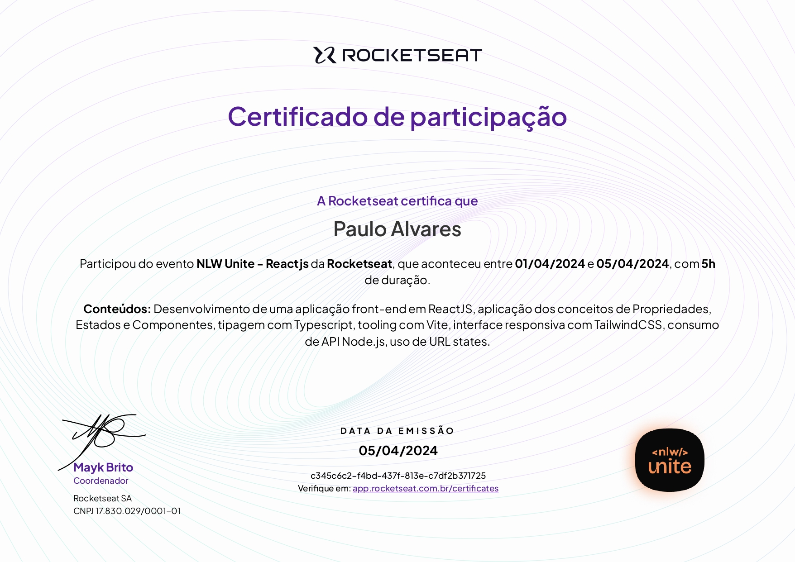

  
  <h3 align="center">NLW Unite - React - Rocketseat</h3>

# 🔍Visão Geral
  Este NLW da Rocketseat apresenta um foco grande no desenvolvimento de um projeto para administração de viagens utilizando React e algumas outras tecnologias aplicadas ao desenvolvimento Front-End. A imersão explora boas práticas de estruturação e estilização de páginas web, ajudando a aprimorar as habilidades na criação de interfaces modernas. Ppermitindo a aplicação dos conhecimentos adquiridos de forma dinâmica e interativa.

  <h3> 💻Tecnologias Aprendidas</h3>
  

# 🏅Certificado

# 🔗Recursos Adicionais
### 🔧Ferramentas
  - <a href="https://code.visualstudio.com/download">Visual Studio Code</a>

### 📖Guias de Referência
  - <a href="https://developer.mozilla.org/en-US/docs/Web/JavaScript">JavaScript</a>
  - <a href="https://nodejs.org/docs/latest/api/">Node</a>
  - <a href="https://www.typescriptlang.org/docs/">TypeScript</a>
  - <a href="https://react.dev/learn">React</a>
  - <a href="https://vite.dev/guide/">Vite</a>

### 📎Curso
  - <a href="https://app.rocketseat.com.br/events/nlw-journey/overview">NLW Journey</a>

# 📬Contato

 
  
  
   
  
  
  

